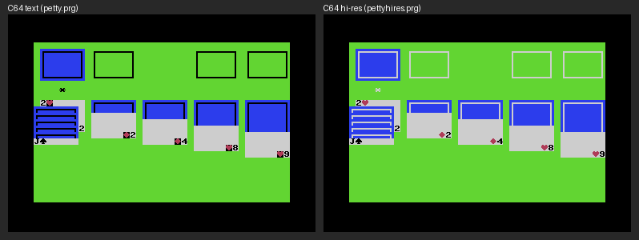

# PETTY

A Commodore 64 terminal (PETSCII + TTY) for Claude Code or any other terminal
program. There are also 80-column clients: one for the C128's 80-column
screen, and one for the C64 that draws 80 columns in the hi-res bitmap. A
third C64 client draws 40 columns in the hi-res bitmap, for colours per cell
and several hundred more glyphs, which the C128 client has too.

A bridge on a Mac or Linux host runs the program in a pty the size of the
client's screen (40×25, or 80×25) and emulates the terminal headlessly
(`@xterm/headless`). It sends the C64 only the screen cells that changed,
already converted to C64 screen codes and colours. The C64 client (1.3 KB of
6502) just copies them into screen RAM and sends key presses back.

Unlike C64 chat clients for Claude (such as
[claude64](https://github.com/theletterf/claude64)), it runs the real Claude Code
CLI. And unlike on-C64 VT100 terminals (CBterm, GTERM), no escape sequences are
parsed on the C64, so it shows anything xterm can.

```
claude ⇄ pty ⇄ xterm (headless) → diff/encode ══ TCP / serial ══► C64: poke screen RAM
                    ▲                                               │
                    └──────────── keymap ◄═══ raw key matrix codes ═┘
```

## Requirements

- macOS or Linux (on Windows, use WSL); cc65 (`ca65`, `ld65`), VICE 3.x (`x64sc`, `x128`), Node 20+
- On real hardware: a SwiftLink-compatible cartridge (6551 ACIA at `$DE00`, NMI),
  wired to the host by a USB-serial adapter or through a WiFi modem (see
  [Real hardware](#real-hardware))

## Run it in VICE

```bash
make                  # builds build/petty.prg, petty128.prg, petty80.prg and pettyhires.prg (regenerates c64/*.inc)
make bridge           # terminal 1: listens on 127.0.0.1:6464, spawns your $SHELL on connect
make vice             # terminal 2: VICE with an emulated SwiftLink on TCP 6464
make vice128          # ...or a C128 in 80 columns: watch VICE's VDC window
make vice80           # ...or the C64 with the soft 80-column screen
make vicehires        # ...or the C64 with the 40-column hi-res screen
```

Start the bridge first, because VICE connects when the client enables the ACIA.
To run Claude Code directly: `make bridge CMD="-- claude"`, or
`node bridge/src/bridge.js [--port N | --serial DEV [--baud N]] [--host H] [--fps N] [--cols N] [--rows N] [--scroll N] [--theme T] [--control N] [--title FILE] [-v] -- <cmd> [args...]`.

When a client first connects, the bridge shows a start screen,
[title.ans](title.ans), for four seconds before it starts the program; any key
starts it sooner (and is not passed on). `--title FILE` shows another file,
`--title none` skips it. It is plain ANSI, so `cat title.ans` shows it in any
terminal too. Regenerate it with `node bridge/scripts/gen-title.js`.

`--theme` sets the screen colour and the program's default colours: `dark`
(default: light grey on black), `light` (black on white), `classic` (the C64's
light blue on blue), or `green` / `amber` (monochrome monitors: every colour
becomes a shade of green or amber, by brightness). A program that asks the
terminal for its colours (OSC 10/11/4) gets the theme's, as shown on the
connected display; Claude Code picks light or dark this way.

The theme can be changed while the bridge runs: C=+F1 on the C64 switches to
the next theme (C=+F2, i.e. C=+SHIFT+F1, to the previous one), or from the host:

```bash
make theme T=amber    # or T=next / T=prev; no T shows the current theme
node bridge/scripts/petty-ctl.js [--port N] theme amber
```

`petty-ctl.js` talks to the bridge's control port, which listens on `--host`
at `--port` + 1 (6465) unless `--control N` says otherwise. The screen is
redrawn in the new colours at once, but a program that asked for the colours
at startup keeps its answer until it restarts: Claude Code started on `dark`
keeps its dark-mode colours after a switch to `light`.


For programs that need a terminal wider than the client's screen, `--cols 80`
runs the pty at 80 columns and shows 40 of them at a time. C=+CRSR→ moves the
window right by 20 columns (0–39 → 20–59 → 40–79), and C=+SHIFT+CRSR→ moves it
left: `make bridge CMD="--cols 80 -- rogue"`.

Likewise `--rows 28` runs the pty at 28 rows and shows 25 of them.
CTRL+CRSR↓ moves the window down by up to half a screen, and
CTRL+SHIFT+CRSR↓ moves it up. Typing moves it to show the cursor's row.

C=+CRSR↓ and C=+CRSR↑ scroll the bridge's scrollback by one line per press;
`--scroll 3` makes it three, like a mouse wheel notch. A program that tracks
the mouse gets one wheel event per press instead, and decides how far to go.

On the C128 and the soft 80-column C64 the program gets an 80×25 terminal, so
it rarely needs `--cols`. Switching clients mid-session resizes the terminal.

If the program exits, press RETURN on the C64 to start it again. The session
survives C64 resets and reconnects; a reset just triggers a full redraw.

## Keys

| C64 | Sends | Claude Code meaning |
|---|---|---|
| RUN/STOP or ← | Esc | interrupt, Esc Esc = rewind |
| SHIFT+RUN/STOP | Ctrl+C | clear input / quit |
| RETURN / SHIFT+RETURN | Enter / Meta+Enter | submit / newline |
| F1 / F3 | Shift+Tab / Tab | cycle mode / complete |
| F5 / F7 | Ctrl+R / Ctrl+O | history search / transcript |
| F2 / F4 | PgUp / PgDn | |
| C=+F1 / C=+F2 | next / previous theme | |
| CRSR keys (+SHIFT) | arrows | |
| C=+CRSR↔ (+SHIFT) | pan right (left) by half a screen when `--cols` is wider than the screen | |
| CTRL+CRSR↕ (+SHIFT) | pan down (up) by half a screen when `--rows` is taller than the screen | |
| C=+CRSR↕ (+SHIFT) | scroll down (up), like a trackpad swipe: mouse wheel if the program tracks the mouse, else the bridge's 200-line scrollback | scroll |
| INST/DEL, SHIFT+INST | Backspace, Delete | |
| CLR/HOME, SHIFT+CLR | Home, Ctrl+L | redraw |
| CTRL+letter | control code | |
| C=+letter | Meta+letter | e.g. C=+P = model picker |
| £, SHIFT+£ | `\`, `\|` | |
| ↑, SHIFT+↑ | `^`, `~` | |
| SHIFT+: / SHIFT+; | `[` / `]` (C= gives `{` / `}`) | |
| SHIFT+@, SHIFT+- | `` ` ``, `_` | |

The soft 80-column and hi-res clients use the same keys. The C128 client sends them too,
plus:

| C128 | Sends |
|---|---|
| ESC | Esc |
| TAB, SHIFT+TAB | Tab, Shift+Tab (cycle mode in Claude Code) |
| ↑ ↓ ← → | arrows; with C=, scroll (↑↓) or pan (←→); with CTRL, pan (↑↓) |
| ALT+any key | Meta: Esc, then the key |
| LINE FEED | Ctrl+J (newline in Claude Code) |
| HELP | F1 |
| keypad | digits, `+ - .`, ENTER = Enter |

The mapping lives in [bridge/src/keymap.js](bridge/src/keymap.js).

## How it maps the display

- **Characters:** the lowercase character ROM is copied to RAM at `$3800`, and
  41 custom glyphs are patched over the PETSCII graphics: missing ASCII
  (`\ ^ _ \` { | } ~`), box drawing, `⏺ ❯ ✻ ✓ … ↑ ↓ →`, card suits `♠ ♥ ♦ ♣`, and quadrant blocks
  for the logo. Codes 128–255 are the inverse of 0–127, so `█ ▐ ▄ ▛ ▜ ▙ ▟` cost
  nothing extra. Other Unicode is aliased or falls back to `?`. Edit
  [bridge/src/glyphs.js](bridge/src/glyphs.js); `make` regenerates `c64/glyphs.inc`.
  The C128 client uploads characters 0–127 to the VDC's font RAM, which holds
  512. The VDC reverses a cell with an attribute bit, so it needs no inverse
  copies, and the bridge loads the other 383 with extended glyphs, as on the
  hi-res C64 (below).
- **Colours:** ANSI 16 colours use a hand-tuned table per theme; 256-colour and
  truecolor use the nearest readable match in a Colodore-style palette. The C128's VDC has the ANSI
  colours themselves (RGBI), so they map one-to-one, except black and dark blue text.
- **Backgrounds:** text mode has no per-cell background. A cell with a coloured
  background is drawn as an inverse glyph (on the C128, a reversed cell) in that colour, so diff lines show as
  solid green or red bars, with text in the screen colour showing through. On
  the light theme, backgrounds only use colours dark enough for that white text.
- **Cursor:** drawn by the bridge as an inverse cell when the program shows it.
- **Soft 80 columns (C64):** the same screen codes drawn from a 4×8 font
  ([bridge/src/font4x8.js](bridge/src/font4x8.js), generated into
  `c64/font4x8.inc`) into the 320×200 hi-res bitmap. Letters are 3 pixels
  wide; `N`, `#`, lines and blocks use all 4. A bitmap cell holds two
  characters and one colour. When two visible characters of different
  colours share one, letters and digits keep the colour over punctuation (then
  the one with more lit pixels wins), and the loser is repainted in its own
  colour by a hardware sprite laid exactly over its pixels. Each 24×21 sprite
  covers the losers of one colour within 6 characters × 2 rows; there are 8,
  given to letters first, then to rows nearest the cursor. Anything beyond
  that keeps its neighbour's colour ([bridge/src/soft80.js](bridge/src/soft80.js)).
  `node bridge/scripts/mock-soft80.js out.ppm 1500 -- <cmd>` previews a
  program's screen, sprites included, without an emulator.
- **Hi-res 40 columns (C64):** the text client's screen drawn into the hi-res
  bitmap, where each 8×8 cell has its own foreground and background. So
  backgrounds are real (black text on a white card, a red ♥ on it),
  underline is drawn on the bottom pixel row, and the
  character set needs no inverse half: codes 0–127 are the text client's, and
  the bridge loads 128–255 with glyphs the other clients only alias
  ([bridge/src/extglyphs.js](bridge/src/extglyphs.js)): heavy, double and dashed box
  drawing, eighth blocks and shades, braille (for graphs), arrows, shapes and
  a few symbols. It keeps up to 128 of them on screen at once (383 on the
  C128), reusing the least recently shown slot; past that, the rest fall back
  to their aliases ([bridge/src/glyphcache.js](bridge/src/glyphcache.js)). Scrolling moves the
  whole bitmap, which takes about 90 ms, as on the soft 80-column screen.

  
- **Pictures (hi-res C64):** inline images in iTerm2's format (OSC 1337, as
  sent by `imgcat`) are drawn in the bitmap. iTerm2's own `imgcat` works;
  where there is none, the bridge puts a small one
  ([bridge/bin/imgcat](bridge/bin/imgcat)) at the end of the program's PATH:

  ```bash
  imgcat photo.png           # its own size, shrunk to fit 40×25 cells
  imgcat -W 20 logo.png      # 20 cells wide (also Npx, N%; -H for height)
  imgcat -t flat art.png     # never dither (-t dither: always)
  imgcat picture.dd          # Doodle! or Art Studio (.art): hi-res, pixel for pixel
  imgcat picture.koa         # Koala Painter: full screen, in multicolour
  imgcat -t koala photo.png  # any picture, converted to multicolour, full screen
  imgcat -t koala:flat x.png # ...never dithered (koala:dither: always)
  ```

  The bridge reads PNG and the C64's own picture formats, known by their file
  sizes. On the hi-res screen each 8×8 cell has two colours; a picture in
  the terminal gets the two that suit each cell best. Colours are matched in
  CIELAB with the picture's chroma scaled down, so vivid colours find the
  VIC's muted ones by hue, and a VIC colour matches itself: a hi-res
  picture (Doodle, Art Studio) comes out pixel for pixel. Flat art (32
  colours or fewer) isn't dithered: each colour maps to one VIC colour
  across the whole picture, keeping colours that look different apart where
  it can (the bands of a sunset), and a cell that needs more colours than it
  can have gives its least-used ones their next best match. Anything else,
  such as a photograph, is ordered-dithered where a mix of two colours comes
  closer than either. `-t flat` or `-t dither`, a type hint that iTerm2's
  imgcat passes on as it is, forces one or the other.

  A Koala picture is multicolour, which the text can't share the screen
  with: the client blanks the screen, switches to multicolour, loads the
  picture (about 10 KB) and shows it until a key is pressed. The key isn't
  passed on, and the bridge then redraws the terminal, which carried on
  meanwhile. `-t koala` (or `multicolour`) converts any picture this way,
  scaled to fill the screen in pixels twice as wide as they are tall, with
  four colours per 4×8 cell, one of them the background of the whole
  picture; `-t koala:flat` or `koala:dither` as above. Dithering has to do
  more good here, since patterns of double-width pixels show more.

  In the terminal, as in iTerm2, a picture starts at the cursor, and the
  cursor ends up after its last row. The terminal holds a private-use placeholder character for each
  of the picture's cells, so it scrolls, clears and is overwritten like text,
  and a redraw (a theme switch, a reconnect) draws it again. A whole
  screen is about 9 KB, sent 2 KB per frame: about 2.5 s at 38400 baud.
  The other clients show a picture as blocks of colour, one per cell
  ([bridge/src/image.js](bridge/src/image.js)).

  Many pictures are released as programs that unpack and show themselves
  (`…_exe.prg`). `prg2pic.js` runs one in VICE until a bitmap has been on
  screen for 2 s, then saves it from memory, where the VIC's registers say it
  is: multicolour as Koala, hi-res as Doodle. Raster tricks such as FLI or
  sprites laid over the bitmap are lost.

  ```bash
  node bridge/scripts/prg2pic.js picture_exe.prg      # writes picture_exe.koa (or .dd)
  ```

## Protocol

See [bridge/src/protocol.js](bridge/src/protocol.js). Host→C64 opcodes are GOTO,
COLOR, PUT, REPEAT, SCROLL, COLORS, CLS and FRAME, plus SPRITE and NOSPRITE for
the soft 80-column screen, GLYPH for the hi-res one and the C128, and
UNDERLINE, BITS (cells of a picture, as raw pixels), VIEW (full-screen
multicolour pictures) and POKE (to load them) for the hi-res one.
Every frame ends with FRAME and
the C64 answers ACK. The bridge keeps only one frame in flight, so fast output
merges into fewer frames instead of overflowing the client's receive buffer (256
bytes; 4 KB on the bitmap C64 clients).
C64→host messages are ACK, `KEY code mods` and HELLO. A client on another
display sends `HELLO_ON id` instead (1 = C128 VDC, 2 = C64 soft 80 columns,
both 80×25; 3 = C64 hi-res, 40×25), and the bridge
resizes the program's terminal to match. For the C128, colours are VDC
attribute bytes (bit 6 reverses the cell, bit 7 selects characters 256–511),
and key codes go up to 87 with ALT as modifier bit 3. For
the hi-res C64, a colour is foreground × 16 + background, and underline is
switched with UNDERLINE.

For each frame the encoder tries every full-screen scroll offset and picks the
cheapest encoding. A spinner tick costs about 7 bytes, and a full redraw about
700–1500 at 40 columns, or up to about 3000 at 80.

## Testing without a C64

```bash
cd bridge && npm test                                 # encoder vs reference decoder
node bridge/scripts/fake-c64.js 6464 $'echo hi\r'            # pretend C64: types keys, prints screen
node bridge/scripts/fake-c64.js --c128 6464 $'echo hi\r'     # same, as an 80-column C128
node bridge/scripts/fake-c64.js --soft80 6464 $'echo hi\r'   # same, as the soft 80-column C64
node bridge/scripts/fake-c64.js --hires 6464 $'echo hi\r'    # same, as the hi-res C64
node bridge/scripts/fake-c64.js --serial /dev/ttys005 0 $'echo hi\r'  # to a bridge on --serial
```

To try the dial step in VICE, put a pretend WiFi modem between VICE and the
bridge: it answers AT commands and dials `ATDT host:port` over TCP.

```bash
make bridge                                  # terminal 1, on 6464
node bridge/scripts/fake-modem.js 6480       # terminal 2
make vice PORT=6480 DIAL=127.0.0.1:6464      # terminal 3: VICE talks to the modem
```

To see how colours and glyphs map, `cat colortest.ans` in a session (for
example `make bridge CMD="-- bash --norc"`). It fits on a 40×25 screen and
shows the 16 ANSI colours as text and backgrounds, attributes, the 256-colour
cube, a truecolor sweep and the custom glyphs. Regenerate it with
`node bridge/scripts/gen-colortest.js`. Screenshots:
[C64](docs/colortest-c64.png), [C128](docs/colortest-c128.png).

## Layout

| Path | What |
|---|---|
| `c64/main.s` | ca65 client: NMI serial receive, command decoder, keyboard scan |
| `c64/petty.cfg` | linker config (program must end below `$3700`) |
| `c64/main80.s` | soft 80-column C64 client: the same, drawing into the bitmap |
| `c64/petty80.cfg` | linker config (program must end below `$2000`) |
| `c64/mainhires.s` | hi-res 40-column C64 client |
| `c64/pettyhires.cfg` | linker config (program must end below `$2000`) |
| `c128/main.s` | C128 client: the same, drawing on the VDC at 2 MHz |
| `c128/petty128.cfg` | linker config (program must end below `$3800`) |
| `c64/dial.inc` | the dial step, included by all four clients |
| `bridge/src/bridge.js` | TCP server or serial port, pty, frame pacing |
| `bridge/src/serial.js` | opens a serial device, raw at the given baud rate |
| `bridge/src/screen.js` | xterm buffer → screen codes/colours |
| `bridge/src/soft80.js` | soft 80 columns: shared cell colours and sprite repaints |
| `bridge/src/protocol.js` | encoder and reference decoder |
| `bridge/src/glyphs.js` / `colors.js` / `keymap.js` | character, colour, key mappings |
| `bridge/src/font4x8.js` | 4×8 font for the soft 80-column screen |
| `bridge/src/extglyphs.js` / `glyphcache.js` | the extra glyphs for the hi-res C64 and the C128, and which are loaded |
| `bridge/src/image.js` | inline images: OSC 1337, PNG and C64 pictures, hi-res conversion |
| `bridge/bin/imgcat` | sends pictures as inline images, where iTerm2's imgcat isn't installed |
| `bridge/scripts/prg2pic.js` | saves the picture a self-showing `.prg` displays, as Koala or Doodle |
| `bridge/scripts/gen-glyphs.js` | writes `c64/glyphs.inc` and `c64/font4x8.inc` |
| `bridge/scripts/fake-c64.js` | pretend client for testing without VICE |
| `bridge/scripts/fake-modem.js` | pretend WiFi modem for testing the dial step |
| `bridge/scripts/petty-ctl.js` | sends commands to the bridge's control port |
| `bridge/scripts/mock-soft80.js` | renders a program's soft 80-column screen to an image |
| `bridge/scripts/gen-colortest.js` | writes `colortest.ans` |
| `bridge/scripts/gen-title.js` | writes `title.ans`, the start screen |

Memory map: code `$0801–$0D50`, receive ring `$3700`, character set `$3800–$3FFF`, screen `$0400`.

Soft 80 columns: code `$0801–$1286`; the VIC uses its second bank, with glyph
tables `$4000–$4FFF` (built at startup), sprite data `$5000–$51FF`, colours
`$5C00` (sprite pointers `$5FF8`) and the bitmap `$6000–$7F3F`; receive ring
`$8000–$8FFF` (4 KB, because a bitmap scroll takes about 90 ms).

Hi-res 40 columns: code `$0801–$0FB2`; the VIC uses its second bank, with the
font `$4000–$47FF` (one page per pixel row), colours `$5C00` and the bitmap
`$6000–$7F3F`; receive ring `$8000–$8FFF`.

C128 (bank 15): code `$1C01–$231F`, font build buffer `$3800–$3BFF` (startup
only), receive ring `$3F00`. VDC RAM: screen `$0000`, attributes `$0800`, font
`$2000–$3FFF` (512 characters; 128–511 loaded by the bridge).

## Real hardware

Two ways to reach the bridge from a SwiftLink:

- **Serial cable:** a USB-serial adapter on the host and a null-modem cable
  to the SwiftLink. The bridge opens the device instead of listening on TCP,
  and sets it to raw 8N1 with no flow control:

  ```bash
  make bridge CMD="--serial /dev/cu.usbserial-1420 -- claude"   # Linux: /dev/ttyUSB0
  ```

  `--baud` defaults to 38400: the SwiftLink's crystal doubles the 6551
  rates, so the clients' "19200" setting gives 38400. If the adapter is
  unplugged, or not there yet, the bridge keeps trying to open it. The
  control port still listens on `--port` + 1.
- **WiFi modem:** a SwiftLink-style WiFi modem, set to 38400 baud, dials the
  bridge, which must listen beyond localhost. Build clients that dial:

  ```bash
  make DIAL=192.168.1.20:6464                            # the host's address
  make bridge CMD="--host 0.0.0.0 -- claude"
  ```

  At startup, such a client sends `ATDT 192.168.1.20:6464` and waits for
  `CONNECT`, dialling again every half minute until one comes. Then it
  discards the rest of the modem's result line and says hello. A client
  built without `DIAL` doesn't dial. Pass the same `DIAL` to every `make`
  that builds the clients (`make vice DIAL=...` too): a different one,
  or none, rebuilds them. If the call drops, run the client again to redial.

Other notes:

- The C128 client needs an 80-column monitor. It blanks the 40-column screen,
  because the VIC shows garbage at 2 MHz.
