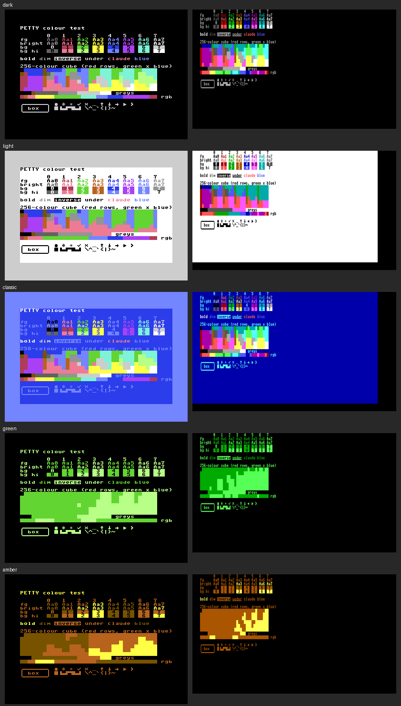

# PETTY

A Commodore 64 terminal (PETSCII + TTY) for Claude Code or any other terminal
program. There are also 80-column clients: one for the C128's 80-column
screen, and one for the C64 that draws 80 columns in the hi-res bitmap.

A bridge on a Mac or Linux host runs the program in a pty the size of the
client's screen (40×25, or 80×25) and emulates the terminal headlessly
(`@xterm/headless`). It sends the C64 only the screen cells that changed,
already converted to C64 screen codes and colours. The C64 client (1.2 KB of
6502) just copies them into screen RAM and sends key presses back.

Unlike C64 chat clients for Claude (such as
[claude64](https://github.com/theletterf/claude64)), it runs the real Claude Code
CLI. And unlike on-C64 VT100 terminals (CBterm, GTERM), no escape sequences are
parsed on the C64, so it shows anything xterm can.

```
claude ⇄ pty ⇄ xterm (headless) → diff/encode ══ TCP / serial ══► C64: poke screen RAM
                    ▲                                               │
                    └──────────── keymap ◄═══ raw key matrix codes ═┘
```

## Requirements

- macOS or Linux (on Windows, use WSL); cc65 (`ca65`, `ld65`), VICE 3.x (`x64sc`, `x128`), Node 20+
- On real hardware: a SwiftLink-compatible cartridge (6551 ACIA at `$DE00`, NMI)

## Run it in VICE

```bash
make                  # builds build/petty.prg, petty128.prg and petty80.prg (regenerates c64/*.inc)
make bridge           # terminal 1: listens on 127.0.0.1:6464, spawns your $SHELL on connect
make vice             # terminal 2: VICE with an emulated SwiftLink on TCP 6464
make vice128          # ...or a C128 in 80 columns: watch VICE's VDC window
make vice80           # ...or the C64 with the soft 80-column screen
```

Start the bridge first, because VICE connects when the client enables the ACIA.
To run Claude Code directly: `make bridge CMD="-- claude"`, or
`node bridge/src/bridge.js [--port N] [--fps N] [--cols N] [--rows N] [--theme T] [-v] -- <cmd> [args...]`.

`--theme` sets the screen colour and the program's default colours: `dark`
(default: light grey on black), `light` (black on white), `classic` (the C64's
light blue on blue), or `green` / `amber` (monochrome monitors: every colour
becomes a shade of green or amber, by brightness). A program that asks the
terminal for its colours (OSC 10/11/4) gets the theme's, as shown on the
connected display; Claude Code picks light or dark this way.



For programs that need a terminal wider than the client's screen, `--cols 80`
runs the pty at 80 columns and shows 40 of them at a time. C=+CRSR→ moves the
window right by 20 columns (0–39 → 20–59 → 40–79), and C=+SHIFT+CRSR→ moves it
left: `make bridge CMD="--cols 80 -- rogue"`.

Likewise `--rows 28` runs the pty at 28 rows and shows 25 of them.
CTRL+CRSR↓ moves the window down by up to half a screen, and
CTRL+SHIFT+CRSR↓ moves it up. Typing moves it to show the cursor's row.

On the C128 and the soft 80-column C64 the program gets an 80×25 terminal, so
it rarely needs `--cols`. Switching clients mid-session resizes the terminal.

If the program exits, press RETURN on the C64 to start it again. The session
survives C64 resets and reconnects; a reset just triggers a full redraw.

## Keys

| C64 | Sends | Claude Code meaning |
|---|---|---|
| RUN/STOP or ← | Esc | interrupt, Esc Esc = rewind |
| SHIFT+RUN/STOP | Ctrl+C | clear input / quit |
| RETURN / SHIFT+RETURN | Enter / Meta+Enter | submit / newline |
| F1 / F3 | Shift+Tab / Tab | cycle mode / complete |
| F5 / F7 | Ctrl+R / Ctrl+O | history search / transcript |
| F2 / F4 | PgUp / PgDn | |
| CRSR keys (+SHIFT) | arrows | |
| C=+CRSR↔ (+SHIFT) | pan right (left) by half a screen when `--cols` is wider than the screen | |
| CTRL+CRSR↕ (+SHIFT) | pan down (up) by half a screen when `--rows` is taller than the screen | |
| C=+CRSR↕ (+SHIFT) | scroll down (up), like a trackpad swipe: mouse wheel if the program tracks the mouse, else the bridge's 200-line scrollback | scroll |
| INST/DEL, SHIFT+INST | Backspace, Delete | |
| CLR/HOME, SHIFT+CLR | Home, Ctrl+L | redraw |
| CTRL+letter | control code | |
| C=+letter | Meta+letter | e.g. C=+P = model picker |
| £, SHIFT+£ | `\`, `\|` | |
| ↑, SHIFT+↑ | `^`, `~` | |
| SHIFT+: / SHIFT+; | `[` / `]` (C= gives `{` / `}`) | |
| SHIFT+@, SHIFT+- | `` ` ``, `_` | |

The soft 80-column client uses the same keys. The C128 client sends them too,
plus:

| C128 | Sends |
|---|---|
| ESC | Esc |
| TAB, SHIFT+TAB | Tab, Shift+Tab (cycle mode in Claude Code) |
| ↑ ↓ ← → | arrows; with C=, scroll (↑↓) or pan (←→); with CTRL, pan (↑↓) |
| ALT+any key | Meta: Esc, then the key |
| LINE FEED | Ctrl+J (newline in Claude Code) |
| HELP | F1 |
| keypad | digits, `+ - .`, ENTER = Enter |

The mapping lives in [bridge/src/keymap.js](bridge/src/keymap.js).

## How it maps the display

- **Characters:** the lowercase character ROM is copied to RAM at `$3800`, and
  41 custom glyphs are patched over the PETSCII graphics: missing ASCII
  (`\ ^ _ \` { | } ~`), box drawing, `⏺ ❯ ✻ ✳ ✓ ✗ … ↑ ↓ → ▶`, and quadrant blocks
  for the logo. Codes 128–255 are the inverse of 0–127, so `█ ▐ ▄ ▛ ▜ ▙ ▟` cost
  nothing extra. Other Unicode is aliased or falls back to `?`. Edit
  [bridge/src/glyphs.js](bridge/src/glyphs.js); `make` regenerates `c64/glyphs.inc`.
  The C128 client uploads the same 256 characters to the VDC's font RAM.
- **Colours:** ANSI 16 colours use a hand-tuned table per theme; 256-colour and
  truecolor use the nearest readable match in a Colodore-style palette. The C128's VDC has the ANSI
  colours themselves (RGBI), so they map one-to-one, except black and dark blue text.
- **Backgrounds:** text mode has no per-cell background. A cell with a coloured
  background is drawn as an inverse glyph in that colour, so diff lines show as
  solid green or red bars, with text in the screen colour showing through. On
  the light theme, backgrounds only use colours dark enough for that white text.
- **Cursor:** drawn by the bridge as an inverse cell when the program shows it.
- **Soft 80 columns (C64):** the same screen codes drawn from a 4×8 font
  ([bridge/src/font4x8.js](bridge/src/font4x8.js), generated into
  `c64/font4x8.inc`) into the 320×200 hi-res bitmap. Letters are 3 pixels
  wide; `N`, `#`, lines and blocks use all 4. A bitmap cell holds two
  characters and one colour. When two visible characters of different
  colours share one, letters and digits keep the colour over punctuation (then
  the one with more lit pixels wins), and the loser is repainted in its own
  colour by a hardware sprite laid exactly over its pixels. Each 24×21 sprite
  covers the losers of one colour within 6 characters × 2 rows; there are 8,
  given to letters first, then to rows nearest the cursor. Anything beyond
  that keeps its neighbour's colour ([bridge/src/soft80.js](bridge/src/soft80.js)).
  `node bridge/scripts/mock-soft80.js out.ppm 1500 -- <cmd>` previews a
  program's screen, sprites included, without an emulator.

## Protocol

See [bridge/src/protocol.js](bridge/src/protocol.js). Host→C64 opcodes are GOTO,
COLOR, PUT, REPEAT, SCROLL, COLORS, CLS and FRAME, plus SPRITE and NOSPRITE for
the soft 80-column screen. Every frame ends with FRAME and
the C64 answers ACK. The bridge keeps only one frame in flight, so fast output
merges into fewer frames instead of overflowing the client's receive buffer (256
bytes; 4 KB on the soft 80-column C64).
C64→host messages are ACK, `KEY code mods` and HELLO. A client on another
display sends `HELLO_ON id` instead (1 = C128 VDC, 2 = C64 soft 80 columns,
both 80×25), and the bridge
resizes the program's terminal to match. For the C128, colours are VDC
attribute bytes, and key codes go up to 87 with ALT as modifier bit 3.

For each frame the encoder tries every full-screen scroll offset and picks the
cheapest encoding. A spinner tick costs about 7 bytes, and a full redraw about
700–1500 at 40 columns, or up to about 3000 at 80.

## Testing without a C64

```bash
cd bridge && npm test                                 # encoder vs reference decoder
node scripts/fake-c64.js 6464 $'echo hi\r'            # pretend C64: types keys, prints screen
node scripts/fake-c64.js --c128 6464 $'echo hi\r'     # same, as an 80-column C128
node scripts/fake-c64.js --soft80 6464 $'echo hi\r'   # same, as the soft 80-column C64
```

To see how colours and glyphs map, `cat colortest.ans` in a session (for
example `make bridge CMD="-- bash --norc"`). It fits on a 40×25 screen and
shows the 16 ANSI colours as text and backgrounds, attributes, the 256-colour
cube, a truecolor sweep and the custom glyphs. Regenerate it with
`node bridge/scripts/gen-colortest.js`. Screenshots:
[C64](docs/colortest-c64.png), [C128](docs/colortest-c128.png).

## Layout

| Path | What |
|---|---|
| `c64/main.s` | ca65 client: NMI serial receive, command decoder, keyboard scan |
| `c64/petty.cfg` | linker config (program must end below `$3700`) |
| `c64/main80.s` | soft 80-column C64 client: the same, drawing into the bitmap |
| `c64/petty80.cfg` | linker config (program must end below `$2000`) |
| `c128/main.s` | C128 client: the same, drawing on the VDC at 2 MHz |
| `c128/petty128.cfg` | linker config (program must end below `$3800`) |
| `bridge/src/bridge.js` | TCP server, pty, frame pacing |
| `bridge/src/screen.js` | xterm buffer → screen codes/colours |
| `bridge/src/soft80.js` | soft 80 columns: shared cell colours and sprite repaints |
| `bridge/src/protocol.js` | encoder and reference decoder |
| `bridge/src/glyphs.js` / `colors.js` / `keymap.js` | character, colour, key mappings |
| `bridge/src/font4x8.js` | 4×8 font for the soft 80-column screen |
| `bridge/scripts/gen-glyphs.js` | writes `c64/glyphs.inc` and `c64/font4x8.inc` |
| `bridge/scripts/fake-c64.js` | pretend client for testing without VICE |
| `bridge/scripts/mock-soft80.js` | renders a program's soft 80-column screen to an image |
| `bridge/scripts/gen-colortest.js` | writes `colortest.ans` |

Memory map: code `$0801–$0CB1`, receive ring `$3700`, character set `$3800–$3FFF`, screen `$0400`.

Soft 80 columns: code `$0801–$11E7`; the VIC uses its second bank, with glyph
tables `$4000–$4FFF` (built at startup), sprite data `$5000–$51FF`, colours
`$5C00` (sprite pointers `$5FF8`) and the bitmap `$6000–$7F3F`; receive ring
`$8000–$8FFF` (4 KB, because a bitmap scroll takes about 90 ms).

C128 (bank 15): code `$1C01–$2245`, font build buffer `$3800–$3BFF` (startup
only), receive ring `$3F00`. VDC RAM: screen `$0000`, attributes `$0800`, font
`$2000–$2FFF`.

## Real hardware notes

- The C128 client needs an 80-column monitor. It blanks the 40-column screen,
  because the VIC shows garbage at 2 MHz.
- The SwiftLink's crystal doubles the 6551 rates, so the "19200" setting gives
  38400 baud. Connect a USB-serial adapter and have the bridge open the serial
  device instead of listening on TCP (not implemented yet).
- A SwiftLink-style WiFi modem can dial the bridge directly (`ATDT <host-ip>:6464`), after the bridge is started with `--host 0.0.0.0`. The client would need a short dial step added first.
